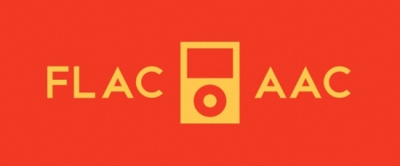

<div align="center">

<br>



<br>

# Convert lossless FLAC files into lossy AAC files</div>

This utility converts FLAC (Free Lossless Audio Codec) files to AAC (Advanced Audio Codec) format. While suitable for any capable device, it is primarily intended for optimised playback on devices with limited available RAM or running third party Rockbox software.

## Features

- **File Quality**: Produces AAC files at a popular 256 kbps bit rate
- **Album Artwork**: Extracts artwork to increase processing speeds
- **Metadata Cleaning**: Removes excessive metadata for faster file loading
- **Batch Conversion**: Converts whole directories of files in a single operation
- **Parallel Processing**: Utilises concurrent processing for faster conversion
- **Easy Resume**: Skips previously converted files
- **Error Logging**: Records information, warnings, and errors for review
- **CLI**: Operates through a simple command line interface 

## Prerequisites

- **Operating System**: Intended for Linux distributions
- **Dependencies**: Both `ffmpeg` and `metaflac` can be installed on Debian based distributions through:

    ```
    sudo apt-get install ffmpeg flac
    ```
- **Playback:** AAC compatible music player or mobile device

## Usage

- **1:** Clone the repository:

    ```
    git clone https://github.com/neoreuvenla/flac-to-aac
    cd flac-to-aac
    ```

- **2:** Run the converter:

    ```
    python3 converter.py
    ```

- **3:** Follow prompts to enter the source and destination directories

## Logging

This code logs information, warnings, and errors to a file called `conversion.log`. This should be reviewed for diagnosing failed conversions and artwork operations.

## Limitations

- Conversion is only available between FLAC and AAC files
- The AAC bitrate is set at 256 kbps
- Artwork is resized to 200x200 pixels 

## Screenshots

<div align="center">

</div>